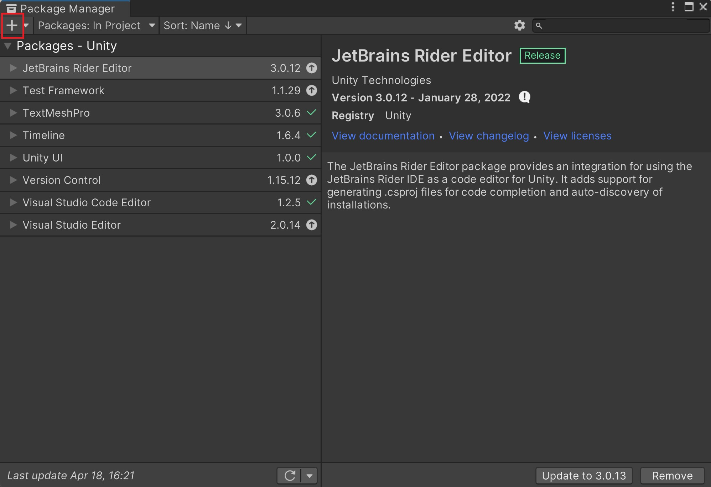
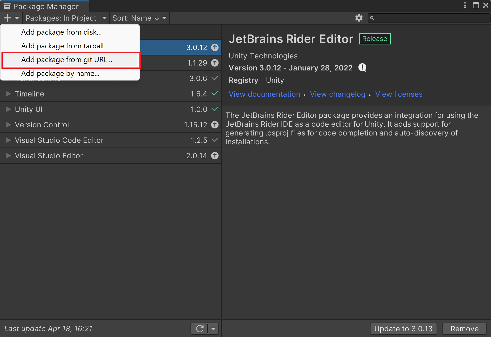
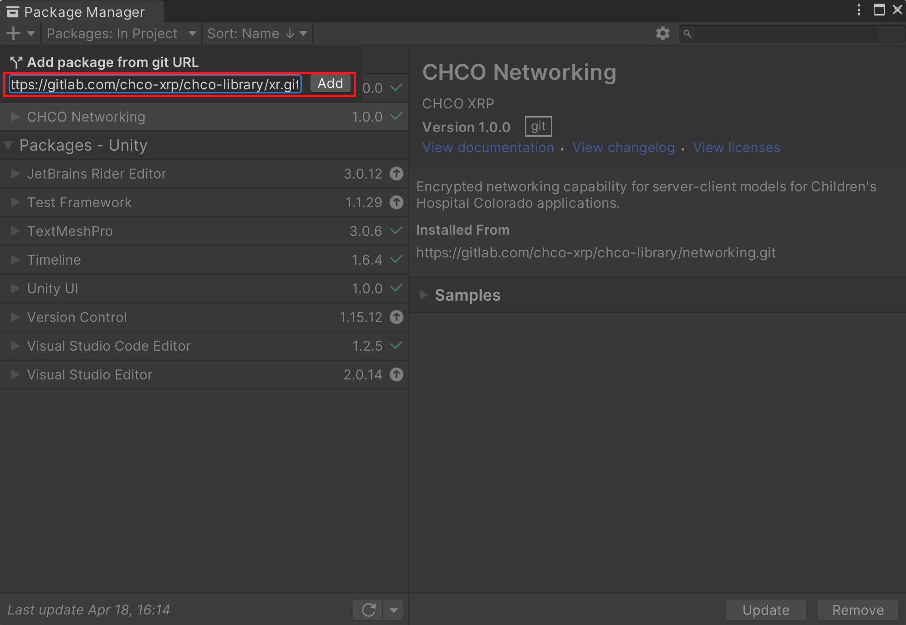
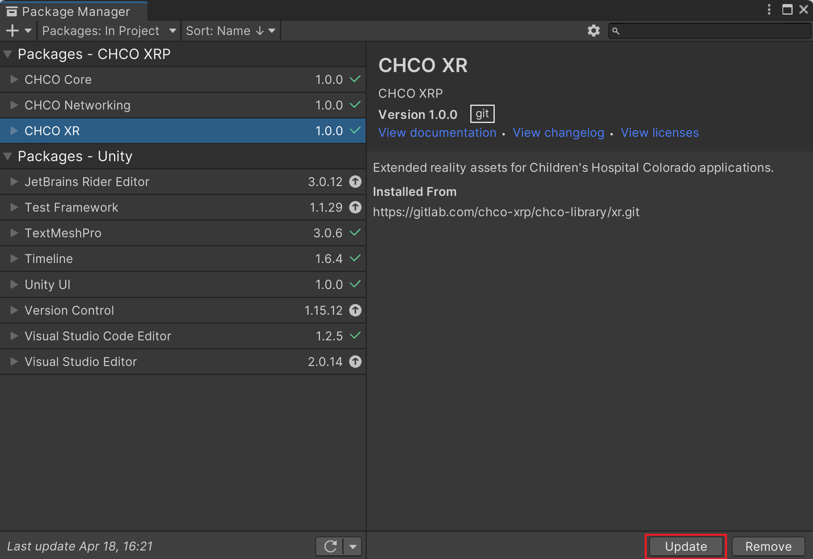

# Meta XR Interaction SDK Extension

## Contents
Scripts, prefabs, and other things I use frequently for Meta XR-based projects.

- Scripts/
    - ResettingOneGrabRotateTransformer.cs - A rotate transformer that resets its rotation upon release.

## Requirements
You will need to install the Meta XR Interaction SDK. Maybe also the Meta XR Interaction SDK Essentials.

## Package Installation

1. In Unity, open the Package Manager by going to **Window** -> **Package Manager**. Select the **+** button in the top left corner.

    

2. Select **Add package from git URL...**.

    

3. Input the following URL and click **Add**: https://github.com/bschoun/meta-xr-interaction-sdk-extensions.git

    

    This project should now show up in the Package Manager and look like the following. You can click **Update** at any time to update the package from the repository.

    

## Usage

[TODO]